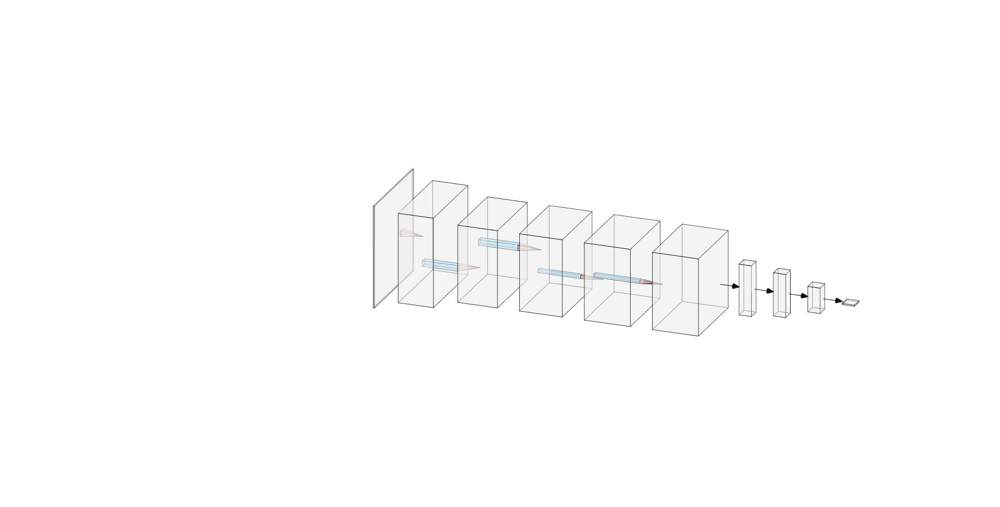
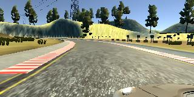
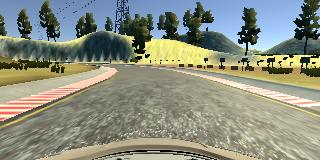
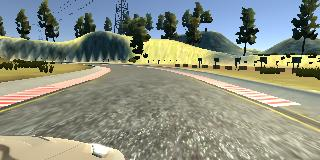
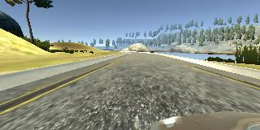
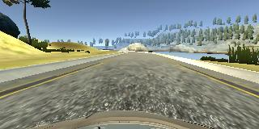
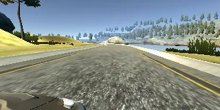

# Behaviorial Cloning Project - Report

[](http://www.udacity.com/drive)

This is the report submitted for review.

**Behavioral Cloning Project**

The goals / steps of this project are the following:
* Use the simulator to collect data of good driving behavior
* Build, a convolution neural network in Keras that predicts steering angles from images
* Train and validate the model with a training and validation set
* Test that the model successfully drives around track one without leaving the road
* Summarize the results with a written report

### Files Submitted & Code Quality

#### 1. Submission includes all required files and can be used to run the simulator in autonomous mode
This repository contains starting files for the Behavioral Cloning Project.

The following files are submitted: 
* [model.py](model.py) (script used to create and train the model)
* [drive.py](drive.py) (updated script to drive the car)
* [model.h5](model.h5) (trained Keras model)
* a report writeup file (this readme)
* video.mp4 (a video recording of your vehicle driving autonomously around the track for at least one full lap)

#### 2. Submission includes functional code
Using the Udacity provided simulator and my drive.py file, the car can be driven autonomously around the track by executing 
```sh
python drive.py model.h5
```

#### 3. Submission code is usable and readable
The model.py file contains the code for training and saving the convolution neural network. The file shows the pipeline I used for training and validating the model, and it contains comments to explain how the code works.

### Model Architecture and Training Strategy

#### 1. An appropriate model architecture has been employed

My model consists of a convolution neural network as designed by the [Nvidia](http://images.nvidia.com/content/tegra/automotive/images/2016/solutions/pdf/end-to-end-dl-using-px.pdf) team (model.py lines 61-78). It has 5 convoution layers with the filter sizes of 5x5 for the first 3 layers and 3x3 for the last 2. In addition the first 3 layers also have a strides set to (2,2). All the convolution layers have a 'relu' activation function for ensuring non-linearity.

This is followed by 4 fully connected layers (model.py lines 73-78).

As part of the pre-processing there is a Keras Cropping layer (model.py lines 62) followed by a lambda to convert the image to grayscale (model.py lines 64) and finally a normalization lambda layer (model.py lines 66). 

#### 2. Attempts to reduce overfitting in the model

The model contains a single dropout layer in order to reduce overfitting (model.py lines 76) with dropout rate set to 0.5. 

The model was trained and validated on different data sets to ensure that the model was not overfitting (model.py lines 81-82). The model was tested by running it through the simulator and ensuring that the vehicle could stay on the track.

#### 3. Model parameter tuning

The model used an adam optimizer, so the learning rate was not tuned manually (model.py line 82).

#### 4. Appropriate training data

Training data was chosen to keep the vehicle driving on the road. I used a combination of center lane driving (twice), reversing the direction of driving the car to help the car generalize better. This was later augmented by additional driving data around the corners to prevent the car from drifting out of the road at the corners. 

### Model Architecture and Training Strategy

#### 1. Solution Design Approach

The overall strategy for deriving a model architecture was to use Lenet since I was familiar with it. However, after making adjustments to the Lenet network (changing output, adding dropout), the performance was not that great. The dataset used to train was center images, reversed center images and images from the  left and right cameras. The images were cropped from the bottom to remove the car's bonnet and the top to remove irrelevant features. 

Subsequently I used the Nvidia model (with some modifications like dropout to avoid overfitting). I also wanted to see the effect for adding more data so started with data from a single lap. Surprisingly, the model generated after training with a single lap around the circuit worked very well at the first attempt (models/model.h9) and was able to drive around the track (I attribute this to beginners luck and overfitting). 

After this I added the reverse direction to the training data set and instead of improving the performance, the performance dropped significantly with the car going off the track. I added another lap of data (going in the correct direction) and this helped to stabilize the car better (except at the corners). 

To counter this I tried to collect recovery data (recording only the corrections). However, the car became a "line hugger"; ie. developed a tendency to it drive on the lane marking. My guess is that that the recovery training data was not collected correctly with the most of the data close to the lanes. This might have taught the car to drive on the lanes. After removing this data set, the car was back on the center line. 

Finally, I decided to collect more positive training data especially around the curves. This seemed to help the network a lot and it was finally able to drive around the track. 

At the end of the process, the vehicle is able to drive autonomously around the track without leaving the road.

All the training was performed on an AWS GPU instance. Using the adam optimizer, I did not have to choose the learning rate. The validation split was set to 20%. Also, it seemed like increasing the number of training epochs did not improve the training much, infact the validation loss started increasing after the first 3-5 iterations. 

#### 2. Final Model Architecture

The final model architecture (model.py lines 67-78) consisted of a convolution neural network with the following layers and layer sizes * Convolution (filters = 24, kernel=5x5, strides=2x2, activation='Relu')
* Convolution (filters = 36, kernel=5x5, strides=2x2, activation='Relu')
* Convolution (filters = 48, kernel=5x5, strides=2x2, activation='Relu')
* Convolution (filters = 64, kernel=3x3, strides=1x1, activation='Relu')
* Convolution (filters = 64, kernel=3x3, strides=1x1, activation='Relu')

follwed by 5 fully connected layers.

Here is a visualization of the architecture (note: visualizing the architecture is optional according to the project rubric)

<p align="center">
  
  <br>
  <b>Model Visualization</b>
</p>


#### 3. Creation of the Training Set & Training Process

To capture good driving behavior, I first recorded two laps on track one using center lane driving. Here is an example image of center lane driving from the three camera perspectives:

<p align="center">
  
  
  
  <br>
  <b>Center Line Driving</b>
</p>


I then recorded the vehicle driving in the opposite direction
<p align="center">
  
  
  
  <br>
  <b>Center Line Driving</b>
</p>


Then I repeated this process on track two in order to get more data points.

To augment the data sat, I also flipped images and angles thinking that this would ... For example, here is an image that has then been flipped:

![alt text][image6]
![alt text][image7]

Etc ....

After the collection process, I had X number of data points. I then preprocessed this data by ...


I finally randomly shuffled the data set and put Y% of the data into a validation set. 

I used this training data for training the model. The validation set helped determine if the model was over or under fitting. The ideal number of epochs was Z as evidenced by ... I used an adam optimizer so that manually training the learning rate wasn't necessary.


